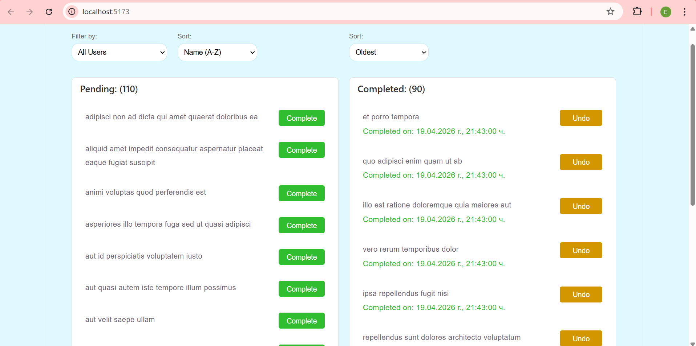
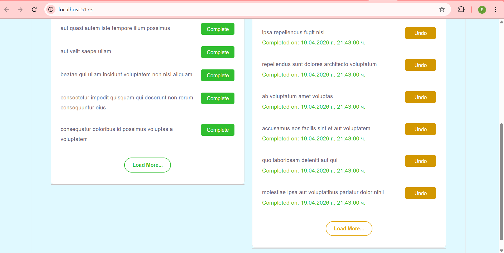

# Screenshots

# Prerequisites
Трябва да имате инсталирано следното:
- Node.js: Версия 14.x или по-нова.
- npm: С инсталация на Node.js.
- Браузър: Google Chrome, Firefox или друг браузър.

# Инсталация
1. git clone https://github.com/ekgeorgieva/TodoApp
2. cd todoAPP
3. npm install

# Отваряне на кода
- code .

# Стартиране на приложението
- npm run dev

След стартиране отворете адреса изписан в терминала (http://localhost:5173/) , за да видите приложението. 